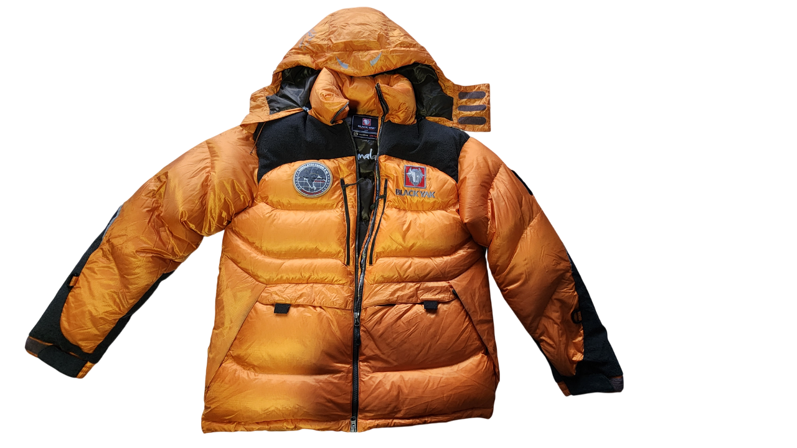
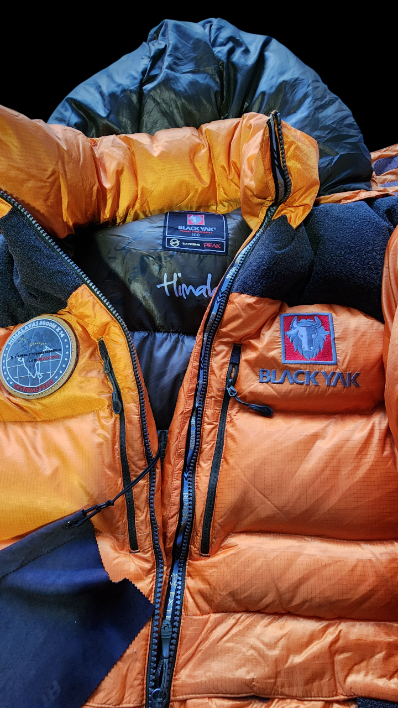
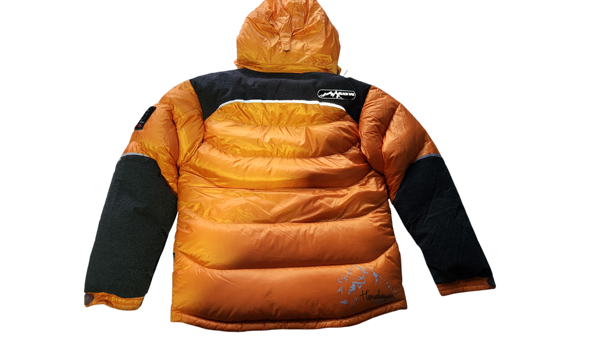

<!DOCTYPE html>
<html lang="es">
<head>
    <meta charset="UTF-8">
    <meta name="viewport" content="width=device-width, initial-scale=1.0">
    <title>Black Yak Himalayan - Casaca Premium</title>
    
</head>
<body>
    <header class="header">
        
BLACK YAK

    </header>

    <section class="hero-section">
        

            

                

                    

                        
                    

                    

                        

                            
                        

                        

                            
                        

                        

                            
                        

                    

                

                

                    TALLA - L   105
                    
                    <h1>Black Yak Himalayan</h1>
                    
                    

                        Casaca de expedición premium con relleno de pluma. Diseñada para conquistar las montañas más exigentes del mundo.
                    

                    

                        S/ 250
                        ⭐ Estado 9/10
                    

                    

                        

                            🪶
                            
Material

                            
Pluma Premium

                        

                        

                            🎨
                            
Colores

                            
Naranja / Negro

                        

                        

                            🏔️
                            
Uso

                            
Expedición Extrema

                        

                        

                            🌡️
                            
Temperatura

                            
-20°C ~ 5°C

                        

                    

                    

                        Esta casaca Black Yak Himalayan representa la cúspide de la tecnología en ropa de montaña. Con relleno de pluma de alta densidad, proporciona un aislamiento térmico excepcional sin comprometer la movilidad. El diseño icónico en naranja y negro no solo es visualmente impactante, sino que también mejora la visibilidad en condiciones extremas. Perfecta para alpinismo, trekking en alta montaña y cualquier aventura que demande el máximo rendimiento.
                    

                    

                        <a href="https://wa.me/51900204360?text=Hola!%20Estoy%20interesado%20en%20la%20casaca%20Black%20Yak%20Himalayan%20de%20S/%20160" class="btn btn-primary" target="_blank">
                            <svg width="24" height="24" viewBox="0 0 24 24" fill="currentColor">
                                <path d="M17.472 14.382c-.297-.149-1.758-.867-2.03-.967-.273-.099-.471-.148-.67.15-.197.297-.767.966-.94 1.164-.173.199-.347.223-.644.075-.297-.15-1.255-.463-2.39-1.475-.883-.788-1.48-1.761-1.653-2.059-.173-.297-.018-.458.13-.606.134-.133.298-.347.446-.52.149-.174.198-.298.298-.497.099-.198.05-.371-.025-.52-.075-.149-.669-1.612-.916-2.207-.242-.579-.487-.5-.669-.51-.173-.008-.371-.01-.57-.01-.198 0-.52.074-.792.372-.272.297-1.04 1.016-1.04 2.479 0 1.462 1.065 2.875 1.213 3.074.149.198 2.096 3.2 5.077 4.487.709.306 1.262.489 1.694.625.712.227 1.36.195 1.871.118.571-.085 1.758-.719 2.006-1.413.248-.694.248-1.289.173-1.413-.074-.124-.272-.198-.57-.347m-5.421 7.403h-.004a9.87 9.87 0 01-5.031-1.378l-.361-.214-3.741.982.998-3.648-.235-.374a9.86 9.86 0 01-1.51-5.26c.001-5.45 4.436-9.884 9.888-9.884 2.64 0 5.122 1.03 6.988 2.898a9.825 9.825 0 012.893 6.994c-.003 5.45-4.437 9.884-9.885 9.884m8.413-18.297A11.815 11.815 0 0012.05 0C5.495 0 .16 5.335.157 11.892c0 2.096.547 4.142 1.588 5.945L.057 24l6.305-1.654a11.882 11.882 0 005.683 1.448h.005c6.554 0 11.89-5.335 11.893-11.893a11.821 11.821 0 00-3.48-8.413z"/>
                            </svg>
                            Comprar por WhatsApp
                        </a>
                    

                    

                        

                            <svg class="contact-icon" viewBox="0 0 24 24">
                                <path d="M12 2C8.13 2 5 5.13 5 9c0 5.25 7 13 7 13s7-7.75 7-13c0-3.87-3.13-7-7-7zm0 9.5c-1.38 0-2.5-1.12-2.5-2.5s1.12-2.5 2.5-2.5 2.5 1.12 2.5 2.5-1.12 2.5-2.5 2.5z"/>
                            </svg>
                            Juliaca, Puno, Perú
                        

                        

                            <svg class="contact-icon" viewBox="0 0 24 24">
                                <path d="M20 4H4c-1.1 0-1.99.9-1.99 2L2 18c0 1.1.9 2 2 2h16c1.1 0 2-.9 2-2V6c0-1.1-.9-2-2-2zm0 4l-8 5-8-5V6l8 5 8-5v2z"/>
                            </svg>
                            Celular: 900 204 360
                        

                    

                

            

        

    </section>

    
</body>
</html>
